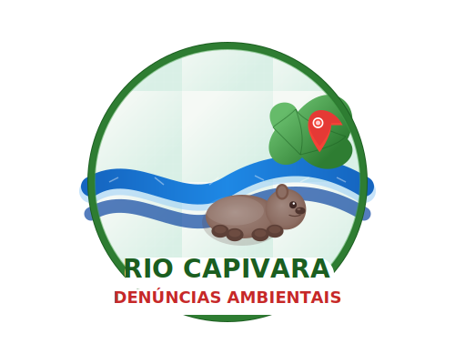

# Rio Capivara - Sistema de Denúncias Ambientais



Um sistema web para denúncias ambientais relacionadas ao Rio Capivara em Camaçari-BA. Esta plataforma permite que cidadãos reportem problemas como desmatamento, despejo ilegal de resíduos e poluição, contribuindo para a preservação deste importante recurso natural.

## 📋 Funcionalidades

- **Mapa Interativo**: Visualização georreferenciada das denúncias
- **Formulário de Denúncia**: Interface intuitiva para reportar problemas ambientais
- **Suporte a Fotos**: Upload de evidências fotográficas
- **Autenticação de Usuários**: Login com e-mail, Google ou Facebook
- **Modo Escuro**: Interface adaptável para uso em ambientes com pouca luz
- **Experiência Offline**: Funcionalidades básicas mesmo sem conexão (PWA)
- **Design Responsivo**: Adaptação perfeita para dispositivos móveis e desktop

## 🛠️ Tecnologias

- **HTML5**: Estrutura semântica para acessibilidade e SEO
- **CSS3 Modular**: Sistema de estilos organizados por componentes
- **JavaScript**: Interatividade e funcionalidades dinâmicas
- **Bootstrap 5**: Framework CSS para responsividade
- **Firebase**: Autenticação, armazenamento e banco de dados
- **Google Maps API**: Visualização e interação com mapas
- **PWA**: Recursos de Progressive Web App para experiência mobile aprimorada
- **Font Awesome**: Biblioteca de ícones

## 🧩 Estrutura do Projeto

```
.
├── assets/
│   ├── css/                   # Arquivos CSS
│   │   ├── main.css           # CSS principal que importa os módulos
│   │   └── modules/           # CSS modular organizado por funcionalidade
│   └── img/                   # Imagens e recursos gráficos
├── js/
│   ├── main.js                # JavaScript principal
│   └── modules/               # JS modular organizado por funcionalidade
├── pages/                     # Páginas adicionais (termos, privacidade)
├── index.html                 # Página principal
├── manifest.json              # Configuração PWA
└── sw.js                      # Service Worker para funcionalidades offline
```

### Sistema CSS Modular

O projeto utiliza uma abordagem de CSS modular, dividindo os estilos em componentes reutilizáveis:

- **Base**: Estilos fundamentais (variáveis, reset, tipografia)
- **Layout**: Estruturas de página (container, header, footer, hero)
- **Componentes**: Elementos de UI reutilizáveis (botões, inputs, modais)
- **Features**: Estilos específicos para funcionalidades (mapa, formulário)
- **Utils**: Classes utilitárias (espaçamento, acessibilidade, responsividade)

## 🚀 Configuração e Instalação

### Pré-requisitos

- Navegador web moderno
- Conta no Firebase (para autenticação e banco de dados)
- Chave API do Google Maps

### Passos para instalação

1. Clone o repositório:

   ```bash
   git clone https://github.com/LuisT-ls/rio-capivara-denuncias.git
   cd rio-capivara-denuncias
   ```

2. Configure o Firebase:

   - Crie um projeto no [Firebase Console](https://console.firebase.google.com/)
   - Habilite Authentication, Storage e Firestore
   - Atualize as credenciais no arquivo `js/modules/firebase-config.js`

3. Configure a API do Google Maps:

   - Obtenha uma chave de API no [Google Cloud Console](https://console.cloud.google.com/)
   - Ative o faturamento (mesmo para o nível gratuito)
   - Substitua a chave de API no arquivo `index.html`

4. Inicie um servidor local:

   ```bash
   # Usando Python
   python -m http.server 8000

   # OU usando Node.js com http-server
   npx http-server
   ```

5. Acesse a aplicação em `http://localhost:8000`

## 📱 PWA (Progressive Web App)

Esta aplicação está configurada como um PWA, permitindo:

- Instalação na tela inicial de dispositivos móveis
- Funcionamento offline básico
- Carregamento rápido e responsivo
- Notificações push (em desenvolvimento)

## 🔒 Privacidade e Segurança

- Opção de denúncias anônimas
- Autenticação segura via Firebase
- Regras de segurança no Firebase para proteção de dados

## 🤝 Contribuição

Contribuições são bem-vindas! Para contribuir:

1. Faça um fork do projeto
2. Crie uma branch para sua feature (`git checkout -b feature/nova-funcionalidade`)
3. Commit suas mudanças (`git commit -m 'Adiciona nova funcionalidade'`)
4. Push para a branch (`git push origin feature/nova-funcionalidade`)
5. Abra um Pull Request

### Guia de Estilo

- Siga a organização modular de CSS e JavaScript
- Mantenha a consistência com o design system existente
- Documente novos componentes e funcionalidades

## 📜 Licença

Este projeto está licenciado sob a licença MIT - veja o arquivo [LICENSE](LICENSE) para detalhes.

## 📬 Contato

Para questões, sugestões ou colaborações, entre em contato através do GitHub ou abra uma issue no repositório.

---

Desenvolvido com ❤️ para proteção ambiental do Rio Capivara em Camaçari-BA.
